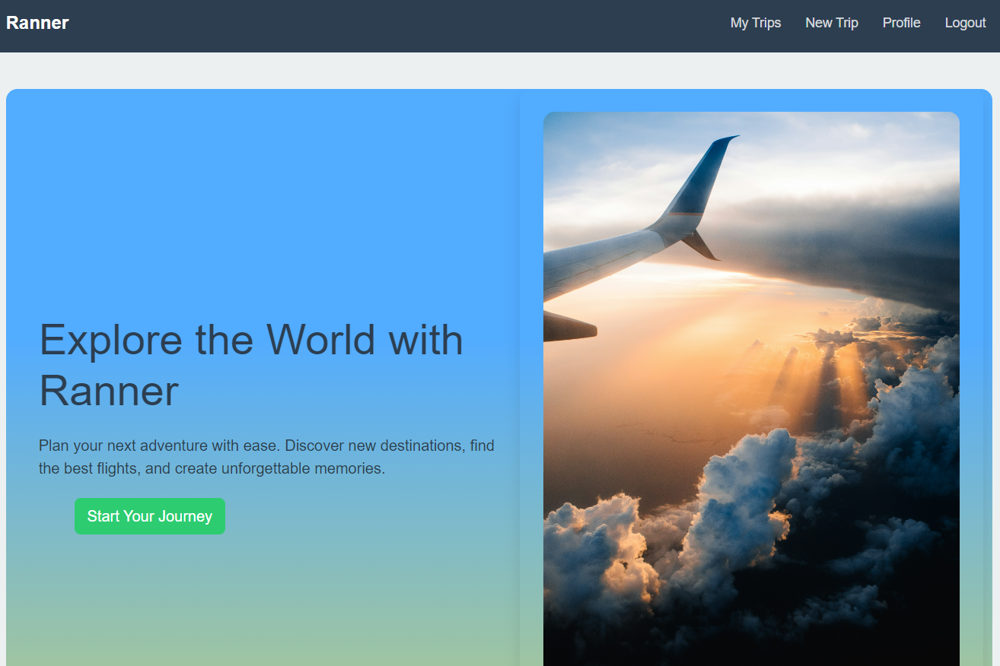
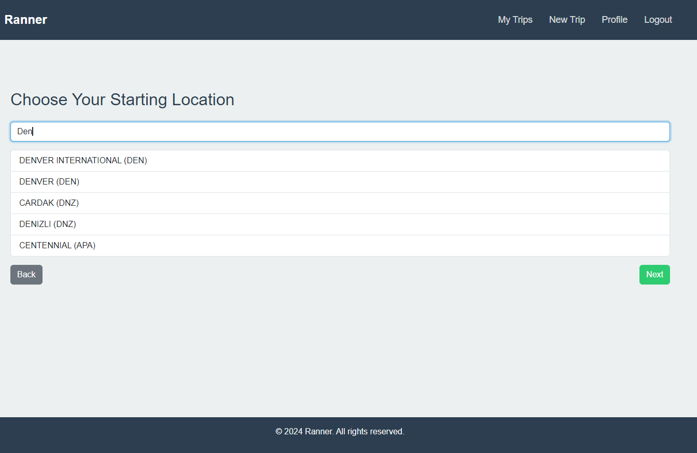
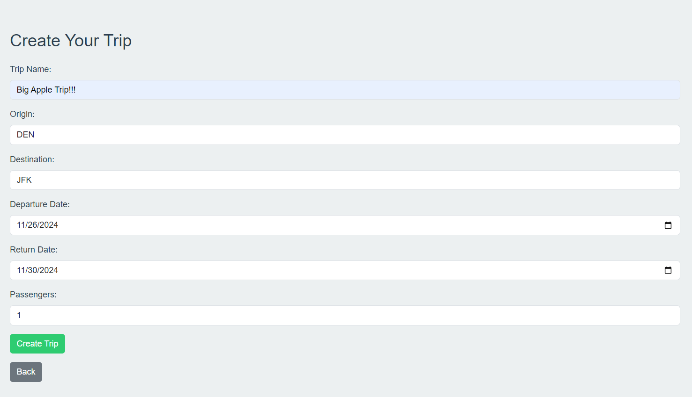
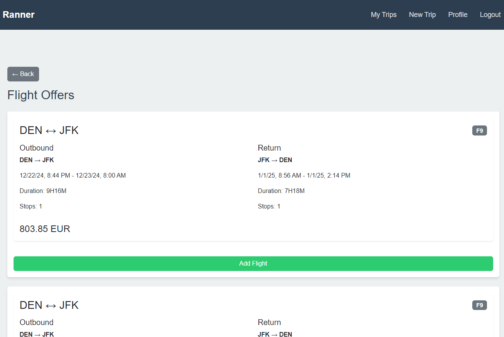
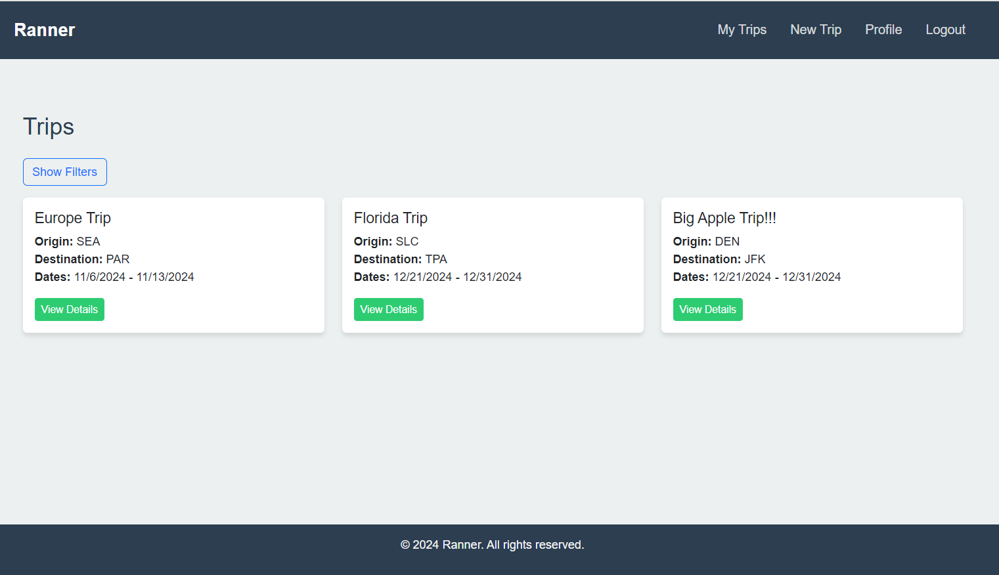

# Ranner: *The Trip Planner*
[View Demo](https://capstone-2-frontend-zk5k.onrender.com) - [API Docs](https://developers.amadeus.com/self-service/apis-docs) - [Report Bug](ranner.flop468@passmail.com)


 ----

*Ranner* empowers users to easily plan and manage every detail of their travel plans. This means balancing information with simplicity. Users are given an experience that enables them to consider the numerous variables of traveling, while also being able to expeditiously move forward with their planning. *Ranner* has the enabling balance for great trip planning! 


*The Ranner Homepage keeps it simple*

### Features
- Intelligent Flight Search: Leveraging the Amadeus API for real-time flight data
- Airport Autocomplete: Smart suggestions for origin and destination airports
- Trip Organization: Create and manage multiple trips with custom details
- Profile Management: Personalized user profiles with trip history
- Responsive Design: Seamless experience across desktop and mobile devices

## User Flow

1. Account Creation
- Register for a new account or log in
- Set up your profile with personal details


2. Trip Planning
- Create a new trip by selecting origin and destination
- Choose travel dates and number of passengers
- Browse available flights with detailed pricing and itinerary information

3. Trip Management
- View all your planned trips in one place
- Edit trip details or remove trips as needed
- Access detailed flight information for each trip


### Technology Stack

##### Frontend

- React 18
- React Router v6
- React Bootstrap
- Vite
- JWT Authentication

##### Backend

- Node.js
- Express
- PostgreSQL
- Amadeus Travel API

##### Testing

- Jest
- React Testing Library

### Getting Started
##### Prerequisites

- Node.js (v18 or higher)
- npm or yarn
- PostgreSQL

### Installation

1. Clone the repository:
```git clone https://github.com/yourusername/ranner.git```
```cd ranner```
2. Install dependencies:
```npm install```
3. Set up environment variables: Create a `.env` file in the root directory and add:
```REACT_APP_BASE_URL=your_backend_url```
```AMADEUS_CLIENT_ID=your_amadeus_client_id```
```AMADEUS_CLIENT_SECRET=your_amadeus_client_secret```
4. Start the development server:
```npm run dev```

The application will be available at `http://localhost:3000`

### Contributing

1. Fork the repository
2. Create your feature branch (git checkout -b feature/AmazingFeature)
3. Commit your changes (git commit -m 'Add some AmazingFeature')
4. Push to the branch (git push origin feature/AmazingFeature)
5. Open a Pull Request (PR)

Please ensure your PR follows the project's coding standards and includes appropriate tests.

### Testing
Run the test suite:
```npm test```
For coverage report:
```npm run test:coverage```


### API Integration
Ranner uses the Amadeus Travel API for flight data. The API provides:

- Flight search and booking
- Airport and city information
- Real-time flight status
- Pricing information

[View Amadeus API Documentation](https://developers.amadeus.com/self-service/apis-docs)
### Screenshots
*Trip creation begins with a simple origin and destination search*

*Then the details are added*

*Select a flight form the up-to-date list*

*All of a user's Trip are here.*


### Future Enhancements

- Integration with hotel booking services
- Car rental reservations
- Trip itinerary sharing
- Travel expense tracking
- Mobile application

### License
This project is licensed under the MIT License - see the LICENSE.md file for details.

### Acknowledgments
- Amadeus for providing the travel API
- React Bootstrap for UI components
- [Homepage photo by Tom Barrett](https://unsplash.com/photos/airplane-on-sky-during-golden-hour-M0AWNxnLaMw?utm_content=creditShareLink&utm_medium=referral&utm_source=unsplash)
- Special thanks to my mentor and the contributors

### Support
For support, email [ranner.flop468@passmail.com](ranner.flop468@passmail.com) or open an issue in the Github repository.

---

### Amadeus Travel API
*Ranner* utilizes the *Amadeus Travel API* for the most current and comprehensive travel data. Currently, *Ranner* gets flight, airport, and city data from *Amadeus*, because of *Ranner*'s focus on a simplistic experience, but *Amadeus* has a wealth of information--everything from city accomodations to rental cars, and even the probability of a flight to be on time, based on the routes history. 
"Amadeus provides a rich set of APIs for the travel industry."
You can explore the *Amadeus API* at the link to the docs below. They also offers an SDK which is what *Ranner* utilizes. 
[Amadeus API Docs](https://developers.amadeus.com/self-service/apis-docs)

---

##### React + Vite

This template provides a minimal setup to get React working in Vite with HMR and some ESLint rules.

Currently, two official plugins are available:

- [@vitejs/plugin-react](https://github.com/vitejs/vite-plugin-react/blob/main/packages/plugin-react/README.md) uses [Babel](https://babeljs.io/) for Fast Refresh
- [@vitejs/plugin-react-swc](https://github.com/vitejs/vite-plugin-react-swc) uses [SWC](https://swc.rs/) for Fast Refresh
